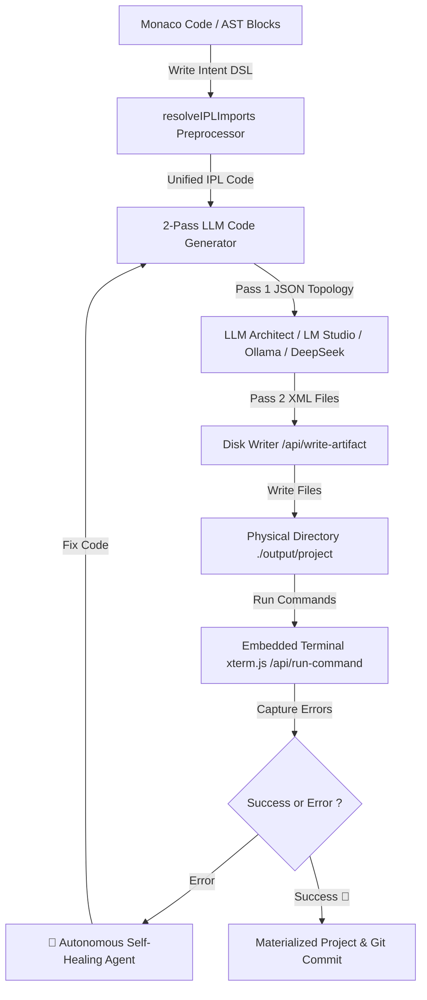

# ⚡ IPL Studio v1.4.0 — Intent Programming Language IDE & Autonomous Agent

[](https://vitejs.dev/)
[](https://reactjs.org/)
[](https://www.typescriptlang.org/)
[](https://tailwindcss.com/)
[](CHANGELOG.md)
[](IPL_AGENT_GUIDE.md)
[](BENCHMARK_HELLO_WORLD.md)
[](ROADMAP.md)
[](LICENSE)

> **IPL Studio** is an AI-powered polyglot, intent-based IDE with autonomous agentic capabilities. It transforms high-level declarative specifications written in **IPL (Intent Programming Language)** into runnable, multi-file codebases (Rust, Python, Node.js, Go, C++, HTML5, Java, etc.) written directly to disk.

---


## ✨ v1.4.0 Highlights — Product Reliability

- **Delivery panel** (P1) — the consolidation agent's report is visible in the product: found / fixed / remaining, clickable issues, token budget, copy-paste repair prompt, popup + maximize.
- **Token telemetry** (P2) — per-run estimated input/output across generation / consolidation / repair, exported in the benchmark report.
- **Independent reviewer** (P3) — opt-in separate reviewer model/endpoint (default = same model), honest `(partagé)`/`(indépendant)` indicator.
- **Execution form factor** (P4) — CLI / Web / GUI / Server / Library pinned in the prompt + a deterministic 0-token form gate.
- **Measurable benchmark** (P5) — harness runnable in plain Node, `--form-factor`, 7-spec `--consolidate` runs, CI bench smoke job.
- **`seed` verb** (P7) — entity instances (catalog/fixture data) in the spec, cross-file validated; the data gap is closed.
- **0-token deterministic gates** — imports, invalid JSON, form drift, IPL-spec leakage, SEARCH/REPLACE marker leakage (with deterministic repair).
- **Serve button** — loopback static server to preview the generated web app straight from the IDE.
- **Systematic README** — every delivery carries a tracking README pointing to `source/main.ipl`.

---

## 📖 Previous Releases

### v1.3.0 Highlights

- **Versioned Release Pipeline** — one manual `workflow_dispatch` turns `main` into a tagged GitHub Release: semver validation, `package.json` + `package-lock.json` bump, CHANGELOG `[Unreleased]` → `[x.y.z] - date`, tag + `gh release create` (see `ROADMAP.md → Versioned Release pipeline`).
- **UX Finishing Pass** — one-time first-run onboarding (`WelcomeModal`), dismissible generation-error banner with an **Open Settings** shortcut, a 6-template project gallery, skeleton loading states, and helpful empty states.
- **Bundle & Performance Budget** — app entry chunk **4.79 MB → 299 kB** (gzip 1.24 MB → 82.8 kB): `codeSplitting.groups` isolate monaco/react/xterm/ui into cacheable vendor chunks, and the 4 `INEFFECTIVE_DYNAMIC_IMPORT` warnings are gone. `monaco-editor` (~4 MB) is a documented, cacheable outlier.
- **Reusable dev-server middleware** — the API + security gate live in a Vite-independent module (`src/server/devApiServer.ts`) so the future desktop shell can mount the exact same policy (Phase 9 prerequisite).
- **CI hardening** — `concurrency: ci-${{ github.ref }}` (cancel-in-progress) keeps commit-heavy pushes fast; the store test suite is now environment-independent (no `.env` / machine API key required).

---

## 🤖 LLM Agent Instruction Sheet & System Prompt

Want to teach your favorite AI model (ChatGPT, Claude, DeepSeek, Ollama, LM Studio, Cursor, Copilot) how to write valid IPL code natively? 

Copy-paste **[IPL_AGENT_GUIDE.md](IPL_AGENT_GUIDE.md)** into your prompt instructions!

---

## 📋 Release Notes & Version History

See [CHANGELOG.md](CHANGELOG.md) for the complete list of release notes, version history, new features, and bug fixes across all releases.

---

## 🌟 Core Architecture & Capabilities

### 🧠 1. Intent Programming Language Specification
- **12 Action Verbs**: Declarative domain operations (`add`, `read`, `set`, `remove`, `search`, `send`, `listen`, `compute`, `if`, `for`, `try`, `return`).
- **7 Human Intent Types**: Constrained type declarations (`text`, `number`, `boolean`, `id`, `date`, `options(...)`, `list`).
- Monarch syntax highlighting powered by **Monaco Editor** and visual AST block representation.
- **Typed AST Parser**: `parseIPLToTree` / `validateIPLCode` produce line-indexed, advisory-only diagnostics ("rails, not walls") — generation is never blocked, and the LLM remains the final interpreter of ambiguity.
- **Semantic Verification**: `src/engine/iplSemantics.ts` cross-references the AST for duplicates, unknown intent types, unprotected `listen` I/O, and unknown `set` targets — all surfaced as `info`/`warning` squiggles and quick advisory checks.
- **Single-Source-of-Truth Grammar**: `src/engine/iplCore.ts` defines the verbs + intent types; the same `grammarSignatureText()` is embedded in the Pass 1 / Pass 2 prompts and regenerates `IPL_AGENT_GUIDE.md` via `npm run doc:guide`, so the vocabulary can never drift.

### 🌐 2. Polyglot 2-Pass LLM Code Generator Engine
- **Pass 1 (Architect)**: Analyzes domain intent and designs multi-file project topology in JSON.
- **Pass 2 (Generator)**: Synthesizes complete XML-tagged source code files with real-time streaming (LM Studio / Ollama / Cloud APIs).
- **Bi-Directional Disk Sync**: Physical file materialization (`IDE ➔ Disk`) and pull synchronization (`Disk ➔ IDE`).

### 🤖 3. Autonomous Self-Healing Agent Debug Loop
- **Error Detection & Diagnostics**: Captures terminal stderr output (`Traceback`, non-zero exit codes).
- **Auto-Fixing**: Analyzes stacktraces via AI, refactors affected files, and re-executes tests automatically (up to 3 repair passes).
- **Deterministic pre-repair first**: LLM-independent fixes (ES-module strip, Tailwind CDN) are applied before any LLM repair call is spent — measured in the benchmark as **repairs-to-success**.
- **NEED_CLARIFICATION loop**: if the LLM cannot fix confidently without a precision, it asks (`NEED_CLARIFICATION: <question>`), the terminal shows a prompt, you answer, and the agent re-repairs with your precision and verifies by re-running — it never guesses.

### 🖥️ 4. Embedded Terminal (`xterm.js`) & Runner
- Integrated `xterm.js` terminal runner for `cargo run`, `python main.py`, `node index.js`, `go run main.go`, etc.
- Real-time stdout/stderr streaming via Node.js middleware API (`/api/run-command`).

### 🔀 5. Integrated Git Version Control & Monaco Side-by-Side Diff
- Native **Monaco DiffEditor** integration to inspect side-by-side code changes between original specification and generated code.
- Interactive version control directly within the IDE (`git status`, `git diff`, staging & committing).

### 📂 6. Multi-File `.ipl` Source Tree & Import Preprocessor
- Organize complex IPL specifications into multiple `.ipl` files (`main.ipl`, `models.ipl`, `events.ipl`).
- Transparent import resolution: `import "submodule.ipl";`.
- Imports are resolved **recursively** (nested modules) with cycle protection; unresolved imports are surfaced as warnings instead of failing silently.
- Semantic checks run on the **merged project** (`validateIPLProject`): duplicate declarations and unknown references are detected across files, and the generated app reflects every module. Edits made in the editor stay in sync with the file map, and generation is always rooted at `main.ipl` deterministically.

### 🧠 7. Semantic Language Server (LSP) Features
- **Go to Definition ($F12$ / Ctrl+Click)**: Semantic resolution over the 3 reference kinds — `declared` (`add entity|module|view`), `produced` (`read`/`compute`/`search`/`send`/`for`-item), and `event` (`listen event on "..."`, including quoted names with `:`). Field references never resolve (no false positives).
- **Hover Provider**: Rich Markdown tooltips showing verb documentation, snippets, and the semantic definition (declared / produced / event) of the symbol under the cursor.
- **Contextual Autocomplete**: Smart suggestions for IPL verbs, intent types, and declared project symbols.
- **Diagnostics Panel**: bottom-panel tab with severity filter, jump-to-line, and one-click application of every advisory quick-fix.
- **Semantic block tree**: visual editor badges each block `declared` / `produced` / `unknown`.
- **Block reorder by drag**: drag any block onto the between-block bars to move it before/after others (or onto a container's nest zone to nest it); palette verbs insert as new blocks at the drop position.

---

## 📐 Architecture Overview



---

## 🛠️ Quick Start & Installation

### Prerequisites
- **Node.js** v18+ and **npm**
- *(Optional for 100% local offline mode)* **LM Studio** or **Ollama** running locally.

### 1. Clone the GitHub Repository
```bash
git clone https://github.com/lecyberbill/IPL_STUDIO.git
cd IPL_STUDIO
```

### 2. Install Dependencies
```bash
npm install
```

### 3. Start Development Server
```bash
npm run dev
```
Open your browser at [http://localhost:5173](http://localhost:5173).

### 3b. Secure the Dev Server (Phase 8)

The in-app terminal / disk / git endpoints (`/api/run-command`, `/api/write-artifact`,
`/api/read-disk`, `/api/confirm-path`, `/api/git/*`) are only active on the local
dev server and are hardened out of the box:

- **Loopback-only**: requests with a non-`localhost` `Host` header are rejected
  (DNS-rebinding guard, enforced twice — Vite's `allowedHosts` + our middleware).
- **Token auth (optional)**: set `IPL_DEV_TOKEN` (env or `.env`) to require the
  `X-IPL-Token` header on every API call. The browser tab attaches it automatically.
- **External write confirmation**: writing outside the project workspace now
  requires an explicit user confirmation (the app asks once, then retries).
- **Command allow-list (optional)**: set `IPL_ALLOWED_COMMANDS=node,python` (comma
  separated) to restrict `/api/run-command` server-side. Without it, the terminal
  panel still flags commands outside its recognized set and asks for approval.

Disable the dev APIs entirely (unless auth is configured) with:

```bash
npm run dev:secure      # sets IPL_PRODUCTION=1, boots Vite normally
# or: IPL_PRODUCTION=1 npm run dev
```

Without `IPL_DEV_TOKEN`, `dev:secure` refuses every API call with `403`; with a
token configured the endpoints stay usable by the app but remain token-guarded.
Never expose this server to an untrusted network.

### 4. Run the Test Suite
```bash
npm test        # one-shot
npm run test:watch
```
**148 tests across 12 suites** cover the IPL parser, the semantic analyzer, the reference index (go-to-def), the grammar signature, the behavioral assertions (exit code / stdout / structured-JSON checks), the store slices, the reusable dev-server middleware, and golden execution fixtures.

### 5. Run the Automated Benchmark Harness
```bash
npm run bench -- --mode mock       # offline pipeline smoke test (no API key needed)
npm run bench -- --mode external   # real end-to-end against DeepSeek (needs VITE_DP_API_KEY)
npm run bench -- --mode lmstudio   # against a local LM Studio server
npm run bench -- --iterations 3    # more runs per spec for stable latency averages
npm run bench -- --python D:\path\.venv\Scripts   # resolve `python` via a venv (typed specs)
npm run bench -- --repair-passes 0 # disable the self-healing repair loop (default: 3)
```
Runs the real 2-Pass pipeline per spec, parses artifacts with the real parser, writes to `output/benchmark/`, and emits a Markdown report (PASS/WARN/FAIL, per-pass latency, token estimates, **repairs-to-success**, and a **trend/regression** section backed by `output/benchmark/history.json`). On a first-try FAIL the harness applies deterministic pre-repair (ES-module strip, Tailwind CDN) before spending LLM repair calls. See [ROADMAP.md](ROADMAP.md) → **Phases 4-5**.

---

## ⚙️ LLM Engine Connection Modes

IPL Studio supports three execution modes configurable in the Settings modal (`⚙️`):

1. **Local LM Studio Server (Recommended for local offline)**:
   - Default Endpoint: `http://localhost:1234`
   - Streaming SSE OpenAI-compatible `/v1/chat/completions` without requiring API keys.
   - Ideal for models like `Liquid LFM-2`, `Llama 3.2`, `DeepSeek-Coder`.

2. **Local Ollama Server**:
   - Default Endpoint: `http://localhost:11434`
   - Recommended models: `qwen2.5-coder`, `llama3.2`, `mistral`, `codellama`.

3. **Cloud API Mode (DeepSeek / OpenAI Compatible)**:
   - Endpoint: `https://api.deepseek.com` (or any OpenAI-compatible API).
   - Dynamic API key configuration with secure client-side storage.

---

## 📁 Repository Structure

```text
IPL_STUDIO/
├── output/                   # Physical disk target folder for generated projects
├── scripts/                  # Dev utilities (gen-agent-guide.ts, run-benchmark.ts → npm run bench)
├── src/
│   ├── components/           # UI components (Monaco, Terminal, Git, Chat, Inspector, Welcome, etc.)
│   ├── engine/               # LLM Code Generator engine, IPL Grammar, typed parser, Artifact Generator
│   ├── server/               # Reusable dev-api middleware (createDevApiServer) — Vite-independent security gate
│   ├── store/                # Zustand store split into slices (editor, projects, settings, generation, disk, logs) + persist
│   ├── App.tsx               # Main IDE Layout
│   └── main.tsx              # React Entrypoint
├── vite.config.ts            # Vite config & API Middlewares (/api/run-command, /api/read-disk, /api/write-artifact)
├── CHANGELOG.md              # Detailed release notes and version history
├── ROADMAP.md                # Canonical roadmap (Phases 4-10) with acceptance criteria
├── package.json
└── README.md
```

---

## 📄 License

This project is licensed under the **MIT License**. See the [LICENSE](LICENSE) file for details.

---

<p align="center">Built with ❤️ for Intent-Based Programming & Autonomous AI Agents.</p>
