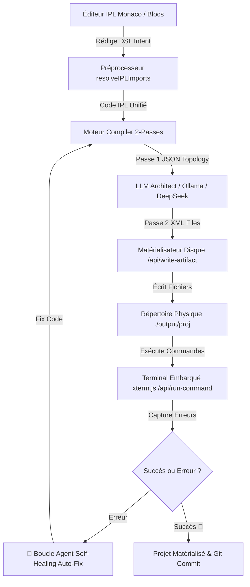

# ⚡ IPL Studio v1.0 — Intent Programming Language IDE & Autonomous Agent

[](https://vitejs.dev/)
[](https://reactjs.org/)
[](https://www.typescriptlang.org/)
[](https://tailwindcss.com/)
[](LICENSE)

> **IPL Studio** est un environnement de développement web polyglotte, intent-based et agentique. Il transforme des spécifications déclaratives à haut niveau de repères d'intentions (**IPL - Intent Programming Language**) en applications réelles et multi-fichiers (Rust, Python, Node.js, Go, C++, HTML5, Java, Kubernetes, etc.) matérialisées directement sur disque.

---

## 🌟 Fonctionnalités Clés

### 🧠 1. Langage d'Intention IPL (12 Verbes Canoniques)
- Modélisation déclarative ultra-lisible basée sur 12 verbes canoniques (`add`, `read`, `set`, `remove`, `search`, `send`, `listen`, `compute`, `if`, `for`, `try`, `return`).
- Coloration syntaxique Monarch sous **Monaco Editor** et vue par blocs AST visuels.

### 🌐 2. Moteur de Compilation LLM Polyglotte 2-Passes
- **Passe 1 (Architecte)** : Cartographie la topologie et la structure des modules multi-fichiers en JSON.
- **Passe 2 (Générateur)** : Produit le code source complet balisé XML et streaming temps réel (SSE / Ollama).
- **Disque Dur Synchronisé** : Matérialisation physique automatique des fichiers dans `output/<nom_projet>`.

### 🤖 3. Mode Agent Codeur Autonome (Self-Healing Debug Loop)
- **Détection & Diagnostic** : En cas d'erreur dans la console (`Traceback`, code d'erreur de sortie `cargo`/`python`), l'Agent capture le log.
- **Auto-Correction** : Analyse du stacktrace par l'Agent, réécriture intelligente des fichiers impactés et ré-exécution automatique dans le terminal (jusqu'à 3 passes de réparation).

### 🖥️ 4. Terminal Embarqué (`xterm.js`) & Runner Direct
- Intégration de `xterm.js` dans l'IDE pour lancer directement `cargo run`, `python main.py`, `node index.js`, `go run main.go`, etc.
- Communication bidirectionnelle et streaming stdout/stderr via middleware Node.js API (`/api/run-command`).

### 🔀 5. Visualiseur Git Diff & Version Control Intégré
- Intégration native de **Monaco DiffEditor** pour comparer en mode côte à côte la version originale et la version révisée par l'IA.
- Contrôle de version direct dans l'IDE (`git status`, `git diff` et staging/commit interactif).

### 📂 6. Arborescence Source Multi-Fichiers `.ipl` & Préprocesseur d'Imports
- Gestion de projets IPL découpés en plusieurs fichiers sources (`main.ipl`, `models.ipl`, `events.ipl`).
- Préprocesseur d'imports transparent : `import "submodule.ipl";`.

### 🧠 7. Services Sémantiques LSP (Language Server Protocol)
- **Go to Definition ($F12$ / Ctrl+Clic)** : Saut instantané à la ligne de déclaration des symboles et entités IPL.
- **Hover Provider** : Info-bulles sémantiques riches au survol de la souris sur les verbes et variables.
- **Autocomplétion Contextuelle** : Suggestions dynamiques des verbes et symboles déclarés.

### 💬 8. Chat LLM Interactif & Refactoring
- Onglet de chat dédié à côté de l'inspecteur de fichiers pour converser avec l'Architecte LLM et demander des corrections ciblées.

### 🔌 9. Cibles de Compilation Extensibles Custom
- Ajout dynamique de nouvelles cibles de compilation (*Java 21 Spring Boot*, *Kubernetes Manifests YAML*, *Swift*, *C#*, etc.) avec des consignes de prompts personnalisables.

---

## 📐 Architecture Globale



---

## 🛠️ Installation & Démarrage Rapide

### Prérequis
- **Node.js** v18+ et **npm**
- *(Optionnel pour le mode local)* **Ollama** s'exécutant sur `http://localhost:11434`

### 1. Cloner le dépôt GitHub
```bash
git clone https://github.com/lecyberbill/IPL_STUDIO.git
cd IPL_STUDIO
```

### 2. Installer les dépendances
```bash
npm install
```

### 3. Démarrer le serveur de développement Vite
```bash
npm run dev
```
Accédez à l'application sur [http://localhost:5173](http://localhost:5173).

---

## ⚙️ Configuration du Moteur LLM

IPL Studio prend en charge deux modes de fonctionnement configurables dans le panneau des paramètres (`⚙️`) :

1. **Mode 100% Local (Ollama)** :
   - Endpoint : `http://localhost:11434`
   - Modèles recommandés : `llama3`, `mistral`, `codellama`, `qwen2.5-coder`.

2. **Mode Cloud (DeepSeek / OpenAI Compatible)** :
   - Endpoint : `https://api.deepseek.com` (ou tout endpoint compatible OpenAI).
   - Sécurité des clés : La clé d'API est lue dynamiquement via la variable d'environnement (ex: `VITE_DP_API_KEY`) sans jamais être stockée en dur dans l'application.

---

## 📁 Structure du Projet

```text
IPL_STUDIO/
├── output/                   # Dossier de matérialisation physique des projets générés
├── src/
│   ├── components/           # Composants UI (Monaco, Terminal, Git, Chat, Inspector, etc.)
│   ├── engine/               # Moteur LLM Compiler, Grammaire IPL, Artefact Generator
│   ├── store/                # Zustand Store (État global IDE, Projets, Persistence)
│   ├── App.tsx               # Layout principal de l'IDE
│   └── main.tsx              # Point d'entrée React
├── vite.config.ts            # Configuration Vite & Middlewares API (/api/run-command, /api/git)
├── package.json
└── README.md
```

---

## 📄 Licence

Ce projet est sous licence **MIT**. Voir le fichier [LICENSE](LICENSE) pour plus de détails.

---

<p center="align">Développé avec ❤️ pour la programmation intent-based & l'IA agentique autonome.</p>
