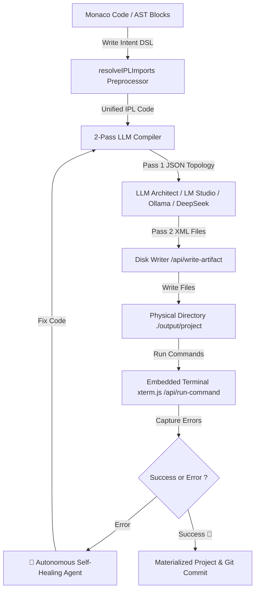

# ⚡ IPL Studio v1.0 — Intent Programming Language IDE & Autonomous Agent

[](https://vitejs.dev/)
[](https://reactjs.org/)
[](https://www.typescriptlang.org/)
[](https://tailwindcss.com/)
[](CHANGELOG.md)
[](LICENSE)

> **IPL Studio** is an AI-powered polyglot, intent-based IDE with autonomous agentic capabilities. It transforms high-level declarative specifications written in **IPL (Intent Programming Language)** into runnable, multi-file codebases (Rust, Python, Node.js, Go, C++, HTML5, Java, etc.) written directly to disk.

---

## 📋 Release Notes & Version History

See [CHANGELOG.md](CHANGELOG.md) for the complete list of release notes, version history, new features, and bug fixes across all releases.

---

## 🌟 Core Architecture & Capabilities

### 🧠 1. Intent Programming Language Specification
- **12 Action Verbs**: Declarative domain operations (`add`, `read`, `set`, `remove`, `search`, `send`, `listen`, `compute`, `if`, `for`, `try`, `return`).
- **7 Human Intent Types**: Constrained type declarations (`text`, `number`, `boolean`, `id`, `date`, `options(...)`, `list`).
- Monarch syntax highlighting powered by **Monaco Editor** and visual AST block representation.

### 🌐 2. Polyglot 2-Pass LLM Compiler Engine
- **Pass 1 (Architect)**: Analyzes domain intent and designs multi-file project topology in JSON.
- **Pass 2 (Generator)**: Synthesizes complete XML-tagged source code files with real-time streaming (LM Studio / Ollama / Cloud APIs).
- **Bi-Directional Disk Sync**: Physical file materialization (`IDE ➔ Disk`) and pull synchronization (`Disk ➔ IDE`).

### 🤖 3. Autonomous Self-Healing Agent Debug Loop
- **Error Detection & Diagnostics**: Captures terminal stderr output (`Traceback`, non-zero exit codes).
- **Auto-Fixing**: Analyzes stacktraces via AI, refactors affected files, and re-executes tests automatically (up to 3 repair passes).

### 🖥️ 4. Embedded Terminal (`xterm.js`) & Runner
- Integrated `xterm.js` terminal runner for `cargo run`, `python main.py`, `node index.js`, `go run main.go`, etc.
- Real-time stdout/stderr streaming via Node.js middleware API (`/api/run-command`).

### 🔀 5. Integrated Git Version Control & Monaco Side-by-Side Diff
- Native **Monaco DiffEditor** integration to inspect side-by-side code changes between original specification and generated code.
- Interactive version control directly within the IDE (`git status`, `git diff`, staging & committing).

### 📂 6. Multi-File `.ipl` Source Tree & Import Preprocessor
- Organize complex IPL specifications into multiple `.ipl` files (`main.ipl`, `models.ipl`, `events.ipl`).
- Transparent import resolution: `import "submodule.ipl";`.

### 🧠 7. Semantic Language Server (LSP) Features
- **Go to Definition ($F12$ / Ctrl+Click)**: Instantly jump to declared symbols and entity lines in Monaco.
- **Hover Provider**: Rich Markdown tooltips showing verb documentation, snippets, and symbol definitions on hover.
- **Contextual Autocomplete**: Smart suggestions for IPL verbs, intent types, and declared project symbols.

---

## 📐 Architecture Overview



---

## 🛠️ Quick Start & Installation

### Prerequisites
- **Node.js** v18+ and **npm**
- *(Optional for 100% local offline mode)* **LM Studio** or **Ollama** running locally.

### 1. Clone the GitHub Repository
```bash
git clone https://github.com/lecyberbill/IPL_STUDIO.git
cd IPL_STUDIO
```

### 2. Install Dependencies
```bash
npm install
```

### 3. Start Development Server
```bash
npm run dev
```
Open your browser at [http://localhost:5173](http://localhost:5173).

---

## ⚙️ LLM Engine Connection Modes

IPL Studio supports three execution modes configurable in the Settings modal (`⚙️`):

1. **Local LM Studio Server (Recommended for local offline)**:
   - Default Endpoint: `http://localhost:1234`
   - Streaming SSE OpenAI-compatible `/v1/chat/completions` without requiring API keys.
   - Ideal for models like `Liquid LFM-2`, `Llama 3.2`, `DeepSeek-Coder`.

2. **Local Ollama Server**:
   - Default Endpoint: `http://localhost:11434`
   - Recommended models: `qwen2.5-coder`, `llama3.2`, `mistral`, `codellama`.

3. **Cloud API Mode (DeepSeek / OpenAI Compatible)**:
   - Endpoint: `https://api.deepseek.com` (or any OpenAI-compatible API).
   - Dynamic API key configuration with secure client-side storage.

---

## 📁 Repository Structure

```text
IPL_STUDIO/
├── output/                   # Physical disk target folder for generated projects
├── src/
│   ├── components/           # UI components (Monaco, Terminal, Git, Chat, Inspector, etc.)
│   ├── engine/               # LLM Compiler engine, IPL Grammar, Artifact Generator
│   ├── store/                # Zustand global store (IDE State, Layout Persistence)
│   ├── App.tsx               # Main IDE Layout
│   └── main.tsx              # React Entrypoint
├── vite.config.ts            # Vite config & API Middlewares (/api/run-command, /api/read-disk)
├── CHANGELOG.md              # Detailed release notes and version history
├── package.json
└── README.md
```

---

## 📄 License

This project is licensed under the **MIT License**. See the [LICENSE](LICENSE) file for details.

---

<p align="center">Built with ❤️ for Intent-Based Programming & Autonomous AI Agents.</p>
